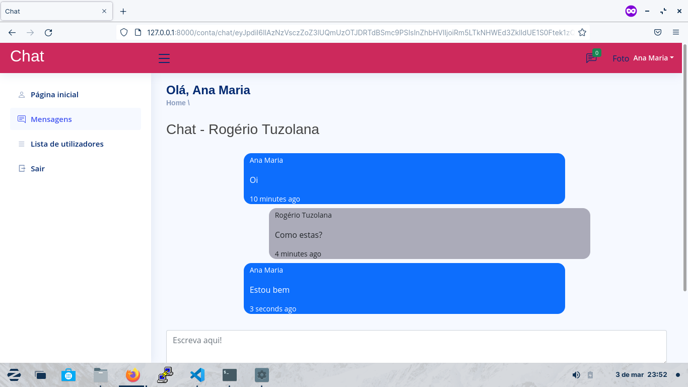
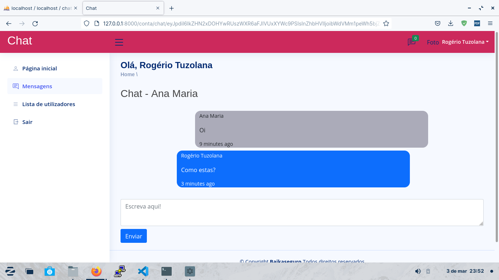
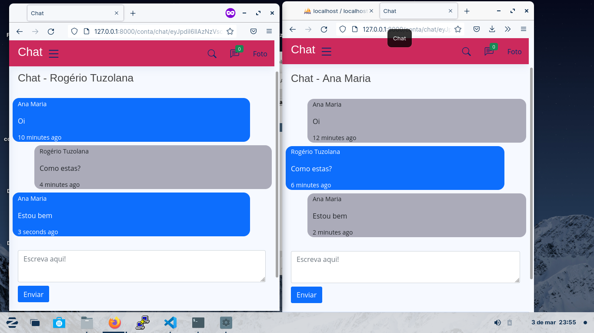

# Chat-App Laravel

Chat-App é um pequeno projecto que permite duas pessoas interagirem em tempo real por mensagens de texto

# Requisitos

Para acessar o painel é necessário criar conta;
Para enviar mensagem é obrigatório autenticar-se;

# Framework
Laravel

# Dependências

- Livewire
- Pusher

# Outros

Alguns detalhes não foram adicionados por exemplo,  a ontagem da quantidade de mensagens enviadas no ícone de mensagem.
